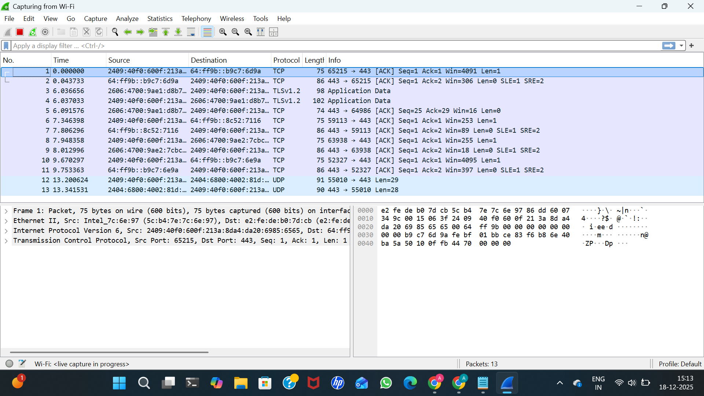
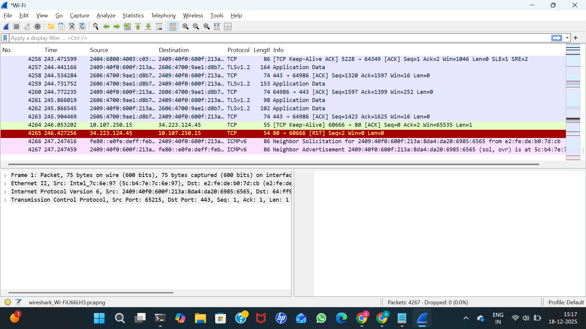
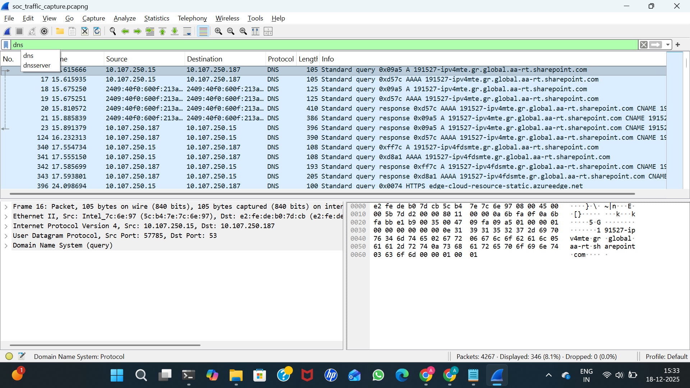
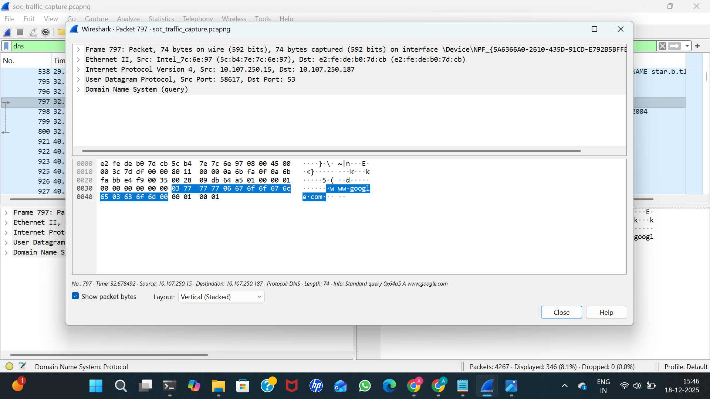
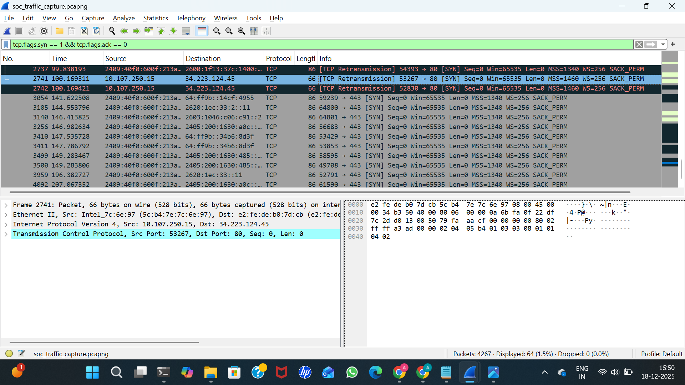

# Wireshark SOC Lab – Network Traffic Analysis

## Objective
To capture and analyze network traffic using Wireshark and identify normal and suspicious communication patterns relevant to a SOC L1 analyst role.

## Scenario
A SOC analyst investigates network traffic from a user workstation after suspicious browsing activity was reported. The objective is to analyze captured packets to identify normal and potentially suspicious traffic patterns such as DNS queries, HTTP communication, ICMP activity, and TCP connection attempts.
## Tools Used
- Wireshark
- Windows OS
- Web Browser
- Command Prompt

## Tasks Performed
- Captured live network traffic using Wireshark
- Analyzed TCP, UDP, DNS, HTTP, and ICMP traffic
- Inspected cleartext HTTP communication
- Reviewed DNS queries and responses
- Identified SYN packets indicating connection attempts
- Used protocol hierarchy and conversations for traffic overview

## Key Findings
- Cleartext HTTP traffic observed
- DNS resolution precedes web communication
- ICMP traffic used for connectivity checks
- SYN packets indicate TCP connection initiation

## Evidence

### Capture Start & Stop

### Protocol & Traffic Analysis

### Statistics

## Conclusion
This lab demonstrates packet-level network traffic analysis using Wireshark from a SOC L1 perspective. 
Normal user activity such as DNS resolution, HTTP communication, ICMP connectivity checks, and TCP 
connection initiation was identified. Cleartext HTTP traffic was observed, highlighting potential 
security risks. TCP SYN packet analysis shows how reconnaissance or connection attempts can be 
detected during initial investigation. This exercise reflects real-world SOC triage and traffic 
analysis workflows.
